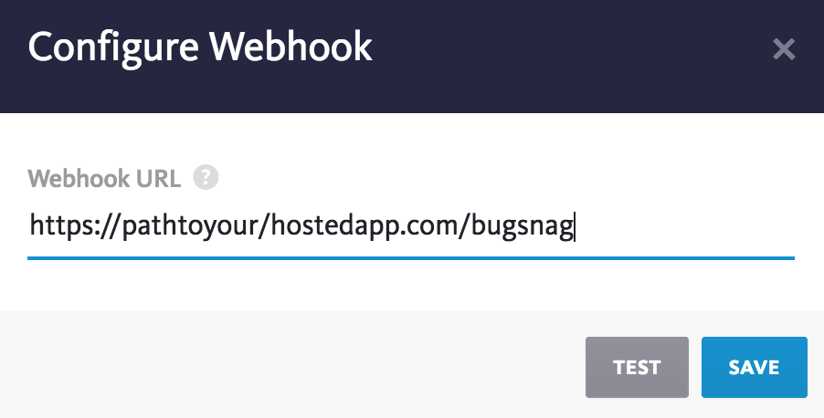
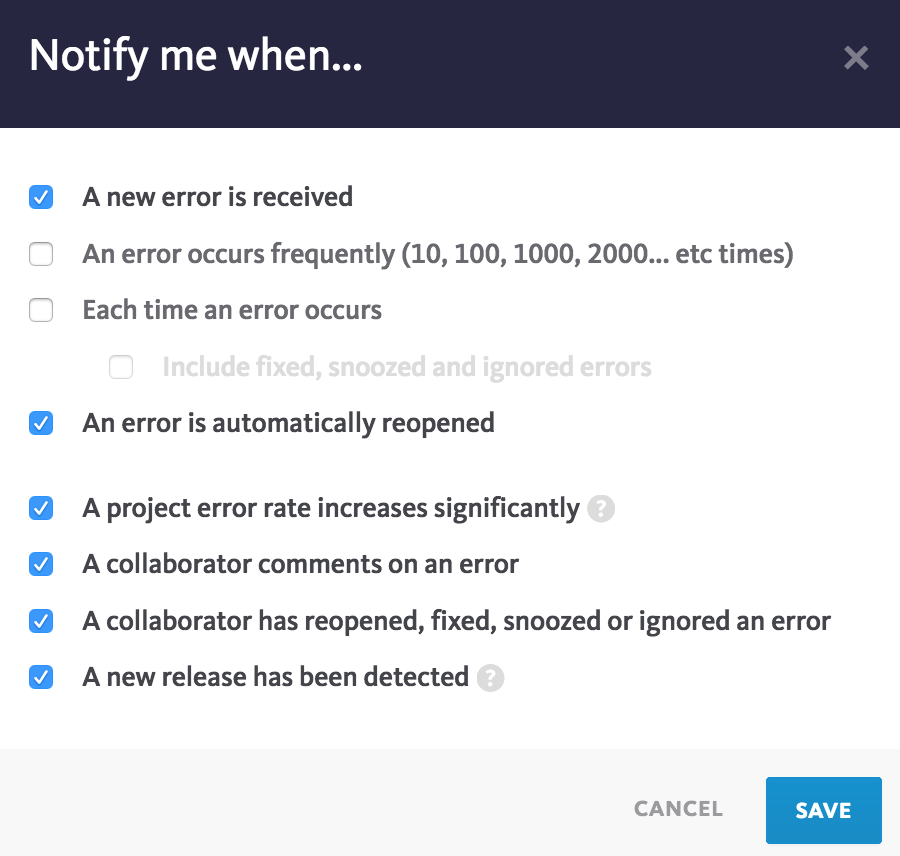

# bugglio

This is a very simple Python3/flask server that, when deployed, can receive JSON notifications from a Bugsnag project's webhook, and then forward some basic details to an on-duty engineer in an sms text message using Twilio's library.

I opted to deploy to heroku (hence the Procfile), but you can host wherever you like. For local testing, you will need to get something like [ngrok](https://www.twilio.com/docs/guides/client/server#running-locally-using-ngrok) working, so the the webhook can connect to your localhost.

## Account(s) setup:

*BUGSNAG*: Create a [Bugsnag](https://www.bugsnag.com/) account and project, if you don't have one already. (you should! Free for small projects!) The project you choose to monitor can be any platform you want (not necessarily python).

Within the settings for this project, choose "Configure integration", and then from the long list of options, choose the generic ["Webhook"](https://docs.bugsnag.com/product/integrations/webhook/) option. The only value you need to add here is the url where notifications should be sent to, which is your hosted url / bugsnag:

https://pathtoyourhostedapp.com/bugsnag

(Of course, you can update this later if you need to sort out your hosting.)



And then you can choose what kind of notifications you would like Bugsnag to send as text. Lots of options and filters available!



Secondly, make a project in Bugsnag for this server itself! Add the api key for this python/flask project to your envirionment as

* BUGSNAG_BUGGLIO_KEY

so you can monitor any errors on this project (these errors are NOT the ones that will be texted to you, this is just fyi as you get the server up and running. Always use Bugsnag!  ;) )

*TWILIO*: Create a [Twilio](https://www.twilio.com/) account and phone number to use for this project. A credit card is needed, but for an evalution account, the cost is negligible.

For the Twilio phone number you are using on this project, go to Manage, and under sms, set the url where sms messages should be received as:

https://pathtoyourhostedapp.com/sms


You will also need to collect various tokens to add to your environment to get Twilio working in your app:

* TWILIO_CALLER_ID  - your Twilio phone number, formatted as +12125551234
* TWILIO_TWIML_APP_SID - don't get the app & account SID's mixed up ;)
* TWILIO_ACCOUNT_SID - ditto
* TWILIO_AUTH_TOKEN - your auth token

More environment variables needed:

* FLASK_SECRET_KEY - any string you'd like
* ON_DUTY  - your real life cell number to receive sms notifications - formatted as +12125551234

## Deploy

Once all your accounts and tokens are setup (honestly, that's the hardest part), just get your server running somewhere so the webhook has access to your /bugsnag url publicly.

```
pip install -r requirements.text
python server.py
```

## Try it out!

An easy test to make sure your server is working well with Twilio is to text your Twilio number from any cell phone.  You should get a generic text response every time:

* "Everything's perfectly all right now. We're fine. We're all fine here, now, thank you. How are you?"  

If not, you have some debugging to do (check your Bugsnag dashboard for the flask project to get started.)

If that works, the real test is to trigger an error on the app itself that your original Bugsnag dashboard is monitoring. Keep in mind, make sure you are triggering the kind of error that satisfies whatever filters you set on your webhook -- e.g. if you chose to only notify on 'production' errors, but your test error is under 'staging', that won't help. ;)

As long as the error satisfies the filters you set on your webhook, you should receive a text on your phone!  The current server will send very basic details, but you can easily customize that to show however many attributes from the [original JSON](https://docs.bugsnag.com/product/integrations/webhook/#json-payload) you would find helpful to receive in a text.

## STILL TO DO:

* users - build a db for admin to login and add engineer's mobile numbers, and track the current status of your app.
* shifts - send text to the correct engineer's mobile based on timestamp & shift schedule.
* response - allow engineers to check open notifications for the project, and snooze/close specific notifications via text.
* tests - always
